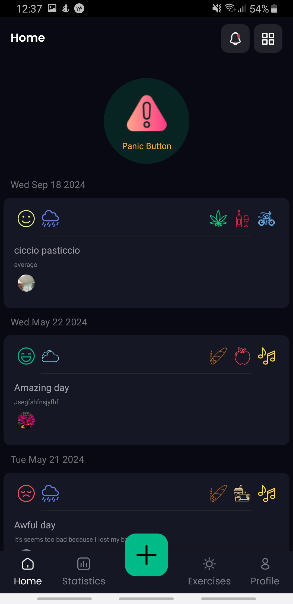
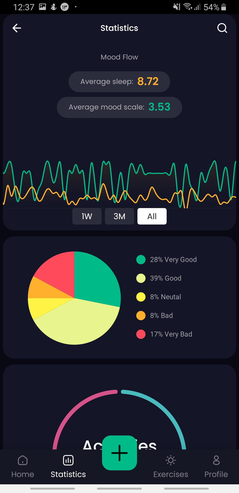
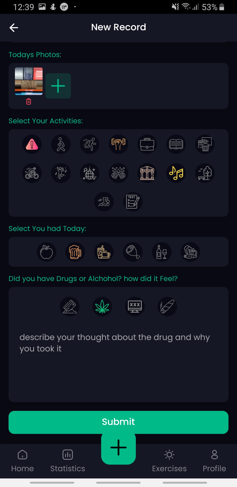
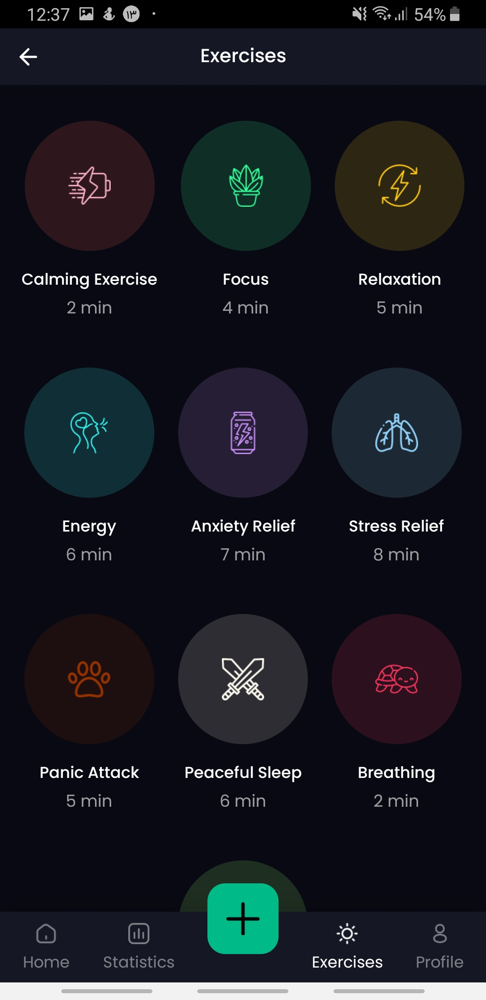
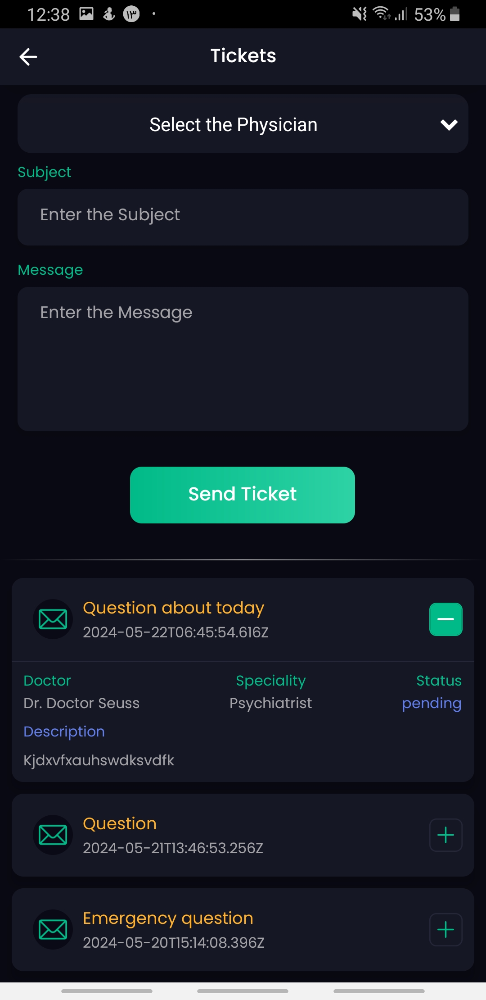

# AMI: Interactive Mental Health Application

AMI (Applicazione Interattiva per la Salute Mentale) is an innovative platform aimed at revolutionizing mental health management through seamless patient-doctor interaction. This application supports personalized care, goal tracking, and effective mental health monitoring.

---

## Features

### Mobile Application
- **Mood Tracking:** Log and view daily moods with detailed statistics.
- **Exercises:** Access guided breathing exercises to manage anxiety.
- **Milestones:** Set and track personal mental health goals.
- **Ticketing System:** Ask questions to doctors and receive timely responses.
- **Notifications:** Get reminders and updates about appointments and messages.

### Web Dashboard for Doctors
- **Patient Records:** Access and manage detailed patient data.
- **Reports:** Generate and download comprehensive reports in PDF.
- **Ticket Management:** Respond to patient queries efficiently.
- **Notes:** Document sessions with patients for better continuity of care.

---

## Technologies Used
- **Frontend:** React (Web), React Native (Mobile)
- **Backend:** Express.js
- **Database & Services:** Firebase (Realtime Database, Storage, Crashlytics, Messaging)

---

## Installation and Setup
1. Clone the repository:
   ```bash
   git clone https://github.com/your-repo-name.git
   ```
2. Install dependencies:
   ```bash
   npm install
   ```
3. Configure Firebase settings in `firebaseConfig.js`.
4. Run the development server:
   - For web: `npm start`
   - For mobile: `npx react-native run-android` or `npx react-native run-ios`

---
## Screenshots

### Mobile Application
<table>
  <tr>
   <td></td>
   <td></td>
   <td></td>
   <td></td>
   <td></td>
  </tr>
</table>

### Web Dashboard
<table>
  <tr>
    <td></td>
    <td></td>
  </tr>
  <tr>
    <td></td>
    <td></td>
  </tr>
  <tr>
    <td></td>
    <td></td> <!-- Empty cell for spacing if needed -->
  </tr>
</table>


---

## Testing and Performance
- **Functionality Testing:** Comprehensive tests of features like mood tracking and ticketing.
- **Compatibility Testing:** Ensures seamless performance across devices.
- **Performance Testing:** Optimized for low RAM and CPU usage with high responsiveness.

---

## Next Steps and Improvements
- Integration of a companion app for family support.
- Enhanced analytics for personalized recommendations.
- Expanded educational resources for mental health awareness.
